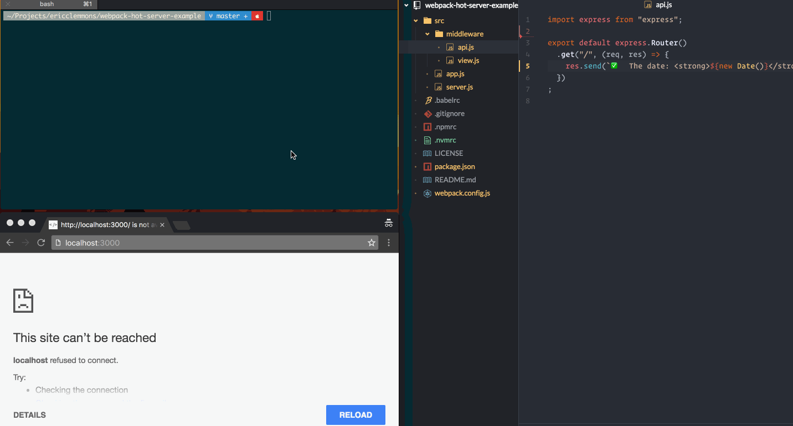

# Webpack Hot Module Replacement (HMR) Example

> The simplest example demonstrating server-side [Hot Module Replacement][hmr]
> with [Webpack][webpack] & [Express][express].
>
> 

This project originated from an internal work project that **worked flawlessly**.
Unfortunately, it's been impossible to replicate up to this point.

### Help Wanted

- [ ] Webpack requires restarting several times before changes are picked up.
- [ ] HMR only works _once_, not with subsequent saves.

[express]: http://expressjs.com/
[hmr]: https://webpack.github.io/docs/hot-module-replacement.html
[webpack]: http://webpack.github.io/
